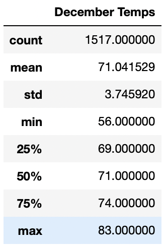

# **TEMPERATURE TRENDS IN OAHU FOR JUNE AND DECEMBER**

## ***OVERVIEW***

### The purpose of this analysis is to provide W. Avy with valuable information about weather conditions in Oahu for the specific months of June and December in order to evaluate if the surf and ice cream shops are good businesses all year round.

## ***RESULTS***

### **June and December Temperature Data**

#### From the images above we can conclude the following:
#### 1. The average temperature in June is a little bit higher than in December, with 74.9 and 71.0 respectively. Fortunately, both months are within the average all year round, which sounds good for the business.
#### 2. The minimum temperature is lower in December than in June, with with 56 vs 64 respectively. Still good levels for the business continuity.
#### 3. The maximum temperature is very similar in both months, being 85 in June and 83 in December. Both temperatures souns great for the ice cream shop business.

## ***SUMMARY***

### Based on the temperarure information described above, we can conlcude that the average, min and max temperatures are acceptable and do not represent any visible threat to the surf and ice cream shop businesses.

### It is recommended though, to perform two additional queries to gather more weather information in order to better support the decision:
### a) Retrieve the precipitation data for June and December using the following queries: session.query(Measurement.date, Measurement.prcp).filter(extract('month', Measurement.date)==6) and session.query(Measurement.date, Measurement.prcp).filter(extract('month', Measurement.date)==12)
